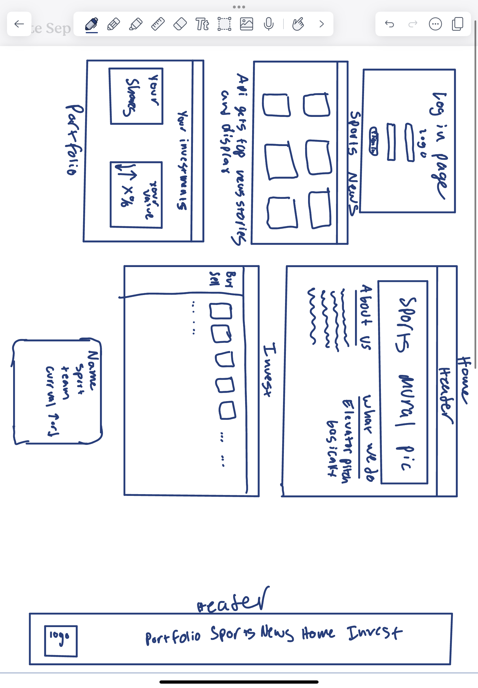

# Play Trade

## Specification Deliverable

### Elevator pitch

Have you ever wanted to get into investing, but haven't known what to invest in? Maybe you don't understand real estate? Maybe you are nervous to invest because you don't understand why stock prices of companies rise and fall. But what if you could invest in something that you're passionate about? Well now you can with "Play Trade"! Play Trade is an investment platform for all things sports and athletics. Invest in your favorite teams, or players. Maybe you are watching someone in college and have a good feeling about the future of their professional career, so you invest in them early on, and WIN BIG when they do! Someone you invested in signs a new endorsement deal? Watch the values of your stock rise. Invest in Play Trade today!

### Design

### Key features

- Secure login over HTTPS
- Ability to select the question to decide
- Display of choices
- Ability to select, and change, top three choices
- Totals from all users displayed in realtime
- Ability for a user to lock in their top three
- Results are persistently stored
- Ability for admin to create and delete questions

### Technologies

I am going to use the required technologies in the following ways.

- **HTML** - Uses correct HTML structure for application. 6 HTML pages. One for login, Home, invest, Sports news, and Portfolio.
- **CSS** - App styling that will be available to use on different screensizes although my target audience is a larger screen. Also using color contrast with the primary colors being black white, and electric blue.
- **React** - Provides login, athlete investment display, applying buys and sells, displaying sports news as well as your portfolio and use of React for routing and components.
- **Service** - Backend service with endpoints for:
  - login
  - retrieving athletes and their price
  - retrieving sports news
  - submitting purchases or issuing sales
- **DB/Login** - Store users, investments, and athletes in database. Register and login users. Credentials securely stored in database. Can't buy and sell investments unless authenticated.
- **WebSocket** - As each user buys or sells, the price and number of shares of athletes or teams changes for all users.
